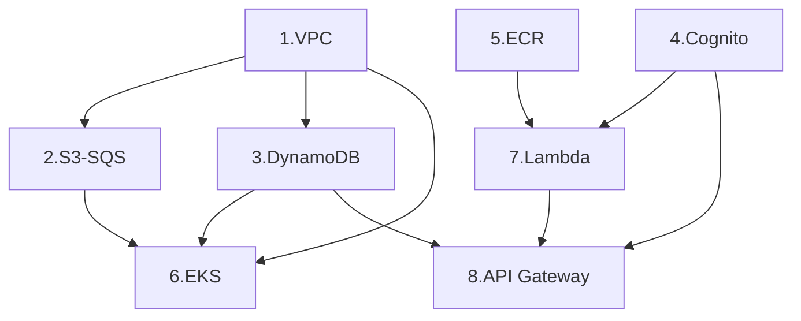

# Arquitetura AWS para o Hackathon FIAP 🚀

[](https://github.com/fiap-8soat-tc-one/hackathon-fiap-iac/actions/workflows/deploy.yml)

Este documento tem como objetivo apresentar e justificar a escolha das tecnologias utilizadas na arquitetura proposta para o Hackaton da FIAP. Cada serviço da AWS e componente de infraestrutura foi selecionado com base em critérios de escalabilidade, segurança, integração, facilidade de operação e aderência a um cenário realista e moderno de aplicações cloud-native.

Abaixo, detalhamos o funcionamento, vantagens e comparações com soluções concorrentes para cada tecnologia adotada, destacando os diferenciais da AWS para garantir uma entrega eficiente, segura e escalável.

## Amazon EKS ☸️

### O que é

O Amazon Elastic Kubernetes Service (EKS) é o serviço gerenciado de Kubernetes da AWS, que elimina a necessidade de manter manualmente o control plane e permite escalar clusters com segurança, integração e resiliência.

### Por que foi escolhido

- Reduz complexidade operacional com plano de controle gerenciado
- Alta disponibilidade automática entre zonas (Multi-AZ)
- Suporte a workloads em EC2, Fargate e Graviton
- Segurança granular com IAM e IRSA (roles por pod)
- Observabilidade integrada com CloudWatch

### Trade-offs

| Plataforma | Prós | Trade-offs |
|------------|------|------------|
| EKS (AWS) | Altamente integrado, seguro, pronto para produção | Custo do plano de controle, curva de aprendizado |
| AKS (Azure) | Boa integração com DevOps e AD | Menos flexível para redes customizadas |
| GKE (Google) | Avançado em automação e upgrades | Preço elevado |
| K8s on-prem | Total controle | Elevado custo de operação |

## Amazon Cognito 🔐

### O que é

Serviço de autenticação e gerenciamento de usuários que oferece suporte nativo a login social, autenticação multifator (MFA), customização de fluxo com triggers e escalabilidade automática.

### Por que foi escolhido

- Integração nativa com API Gateway e IAM
- Autenticação via email/senha ou provedores sociais (OAuth)
- Suporte a MFA e políticas de senha
- Custos controlados por número de usuários ativos

### Comparativo

| Plataforma | Prós | Trade-offs |
|------------|------|------------|
| Cognito (AWS) | Serverless, IAM nativo, escalável | Complexidade inicial |
| Auth0 | Interface amigável, fácil de usar | Alto custo em escala |
| Firebase Auth | Simples e rápido para apps móveis | Pouco flexível para requisitos enterprise |
| Azure AD B2C | Robustez e SSO | Curva de configuração longa |

## Amazon API Gateway 🌐

### O que é

Serviço gerenciado para criar e expor APIs REST, HTTP e WebSocket com recursos integrados como autenticação, versionamento e throttling.

### Por que foi escolhido

- Fácil integração com Lambda, Cognito e VPC
- Controle de acesso por chave, JWT ou IAM
- Suporte a CORS, caching, deploys automatizados
- Custo sob demanda, por requisição

### Comparativo

| Plataforma | Prós | Trade-offs |
|------------|------|------------|
| API Gateway (AWS) | Nativo, serverless, integrado com IAM | Curva inicial e limitação de throughput em planos básicos |
| Kong | Open-source, personalizável | Precisa ser hospedado e gerenciado |
| Apigee (GCP) | Completo para grandes empresas | Complexidade e custo |
| Azure API Management | Completo e integrado ao AD | Requer tuning fino |

## Amazon DynamoDB 🗃️

### O que é

Banco de dados NoSQL serverless com latência de milissegundos, billing por requisição e escalabilidade horizontal automática.

### Por que foi escolhido

- Alta disponibilidade e performance consistente
- Sem necessidade de provisionamento de instâncias
- Recursos como TTL, Streams e índices secundários
- Ideal para cargas com leitura/escrita intensa e imprevisível

### Comparativo

| Plataforma | Prós | Trade-offs |
|------------|------|------------|
| DynamoDB (AWS) | Serverless real, baixo custo operacional | Consultas limitadas por chave, sem joins |
| MongoDB Atlas | Consultas flexíveis | Precisa gerenciar escalabilidade |
| CosmosDB | Multi-modelos e replicação global | Mais caro |
| Firebase Firestore | Foco em apps mobile | Limitação em filtros e modelagem |

## Amazon SQS 📩

### O que é

Serviço de mensageria assíncrona totalmente gerenciado com suporte a filas padrão (best-effort) e FIFO (ordenação garantida).

### Por que foi escolhido

- Ideal para desacoplar componentes (ex: uploads e processamento)
- Integração nativa com S3 e Lambda
- Simples de operar, escalável, seguro com IAM

### Comparativo

| Plataforma | Prós | Trade-offs |
|------------|------|------------|
| SQS (AWS) | Escalável, confiável, baixo custo | Latência maior do que brokers em tempo real |
| RabbitMQ | Ordenação, TTL, plugins | Requer servidores e manutenção |
| Kafka | Streaming de eventos em larga escala | Complexidade de setup |
| Azure Queue | Simples e básico | Poucos recursos avançados |

## Amazon ECR 🐳

### O que é

Repositório privado de imagens Docker gerenciado, com integração direta ao ECS, EKS e CodePipeline.

### Por que foi escolhido

- Login via IAM (sem credenciais expostas)
- Scan de vulnerabilidade automático
- Alta integração com pipelines CI/CD AWS
- Escalabilidade nativa e billing por armazenamento

### Comparativo

| Plataforma | Prós | Trade-offs |
|------------|------|------------|
| ECR (AWS) | Seguro, automatizável, IAM nativo | Pode ter custo superior a repositórios públicos |
| DockerHub | Popular e gratuito (limitado) | Limite de pull e segurança frágil |
| GitHub Container Registry | Prático para devs GitHub | Menos controle granular de permissões |
| GCR / ACR | Integrado à GCP/Azure | Limitado fora de seus ecossistemas |

## AWS Lambda ⚙️

### O que é

AWS Lambda é um serviço de computação serverless que permite executar código em resposta a eventos, sem precisar provisionar ou gerenciar servidores. O código pode ser acionado por eventos de diversos serviços da AWS, como S3, DynamoDB, API Gateway, SQS, entre outros.

### Por que foi escolhido

- Elimina a necessidade de gerenciar infraestrutura para execução de funções simples
- Excelente para processamento de eventos (upload de arquivos, callbacks, validações)
- Alta integração com quase todos os serviços AWS
- Escala automaticamente conforme a demanda
- Modelo de cobrança por invocação e tempo de execução (pay-per-use)

### Exemplos de uso no projeto

- Processamento automático após upload de arquivos em um bucket S3
- Validação de dados recebidos via API Gateway
- Comunicação com DynamoDB ou envio de mensagens ao SQS

### Comparativo

| Plataforma           | Prós                                          | Trade-offs                                |
|----------------------|-----------------------------------------------|--------------------------------------------|
| Lambda (AWS)         | Serverless real, escalável, altamente integrado | Cold start em linguagens como Java         |
| Cloud Functions (GCP)| Fácil de usar, integração com Firebase        | Menos granularidade de controle            |
| Azure Functions      | Boa integração com Azure Logic Apps           | Requer atenção ao setup de networking      |
| OpenFaaS / Knative   | Flexível, pode ser usado on-prem              | Requer gerenciamento e provisionamento     |

## Arquitetura Detalhada 🏗️

### Componentes Implementados

#### 1. Rede (VPC Module)

- VPC com CIDR 10.0.0.0/16
- 2 Subnets públicas em diferentes AZs (us-east-1a, us-east-1b)
- Internet Gateway para acesso externo
- Route Tables para roteamento de tráfego

#### 2. Armazenamento e Mensageria (S3-SQS Module)

- Bucket S3 para armazenamento de arquivos
- Fila SQS para eventos de upload
- Fila SQS para notificações
- Integração S3 -> SQS para notificação automática de uploads
- Políticas IAM para acesso seguro

#### 3. Banco de Dados (DynamoDB Module)

- Tabela para rastreamento de uploads
- Índices GSI para consultas eficientes:
  - email-index
  - url_download-index
  - status-index
  - data-criacao-index
- Política de acesso granular via VPC

#### 4. Autenticação (Cognito Module)

- User Pool com autenticação email/senha
- Client App configurado para fluxos:
  - ALLOW_USER_PASSWORD_AUTH
  - ALLOW_REFRESH_TOKEN_AUTH
  - ALLOW_USER_SRP_AUTH
- Tokens configurados:
  - Access Token: 1 hora
  - ID Token: 1 hora
  - Refresh Token: 30 dias

#### 5. Container Registry (ECR Module)

- Repositórios para imagens Docker:
  - presigned-lambda-repo
  - auth-lambda-repo
  - file-engine-repo
  - notification-repo

#### 6. Orquestração (EKS Module)

- Cluster EKS gerenciado
- Node Group com 2 instâncias t3.medium
- Security Groups para comunicação
- IAM Roles para cluster e nodes
- Integrações com CloudWatch

#### 7. Funções Serverless (Lambda Module)

- Lambda para autenticação
- Lambda para geração de URLs pré-assinadas
- Ambiente configurado para Java
- X-Ray habilitado para rastreamento
- CloudWatch Logs integrado

#### 8. API Gateway

- REST API com endpoints:
  - /auth: Autenticação (POST)
  - /presigned: Geração de URLs (GET)
  - /files/{id}: Operações no DynamoDB (GET)
- Autorização via Cognito
- CloudWatch Logs com retenção de 7 dias

### Fluxo de Execução 🔄

1. **Autenticação**
   ```
   Cliente -> API Gateway (/auth) -> Lambda -> Cognito -> JWT Token
   ```

2. **Upload de Arquivo**
   ```
   Cliente -> API Gateway (/presigned) -> Lambda -> S3 Presigned URL
   Cliente -> S3 Upload -> SQS Notification -> Lambda Processing
   ```

3. **Consulta de Status**
   ```
   Cliente -> API Gateway (/files/{id}) -> DynamoDB -> Response
   ```

### Dependências entre Módulos 🔗



### Considerações de Segurança 🔒

1. **Rede**
   - VPC com subnets em múltiplas AZs
   - Security Groups restritivos
   - Internet Gateway controlado

2. **Autenticação e Autorização**
   - Cognito com políticas de senha fortes
   - JWT tokens com vida útil limitada
   - IAM roles granulares

3. **Dados**
   - DynamoDB com criptografia em repouso
   - S3 com URLs pré-assinadas
   - Logs retidos por 7 dias

### Monitoramento e Observabilidade 📊

1. **Logs**
   - CloudWatch Logs para API Gateway
   - X-Ray para rastreamento de Lambda
   - EKS integrado com CloudWatch

2. **Métricas**
   - DynamoDB capacity tracking
   - Lambda execution metrics
   - API Gateway request tracking

### Escalabilidade ⚖️

1. **Compute**
   - EKS Node Group: 2-2 nodes
   - Lambda: Escala automática
   - API Gateway: Sem limites configurados

2. **Storage**
   - DynamoDB: PAY_PER_REQUEST
   - S3: Sem limites
   - SQS: Filas padrão

### Custos e Otimizações 💰

1. **Compute**
   - EKS: t3.medium para melhor custo-benefício
   - Lambda: Timeout de 60s
   - Spot Instances não utilizadas (possível otimização)

2. **Storage**
   - DynamoDB: Pay-per-request para cargas variáveis
   - S3: Lifecycle policies podem ser implementadas
   - Logs: Retenção de 7 dias para controle de custos

## Próximos Passos 🎯

1. **Otimizações**
   - Implementar Spot Instances no EKS
   - Configurar S3 Lifecycle policies
   - Adicionar WAF na API Gateway

2. **Monitoramento**
   - Implementar dashboards CloudWatch
   - Configurar alarmes para métricas chave
   - Adicionar tracing distribuído

3. **Segurança**
   - Implementar AWS KMS para criptografia
   - Adicionar AWS Shield para DDoS
   - Configurar AWS Config Rules

## Conclusão 📘

A arquitetura foi desenhada com foco em boas práticas de microsserviços, segurança, resiliência e facilidade de automação. Cada componente da AWS foi selecionado por sua integração nativa, confiabilidade e adesão ao modelo serverless, reduzindo custos operacionais e acelerando o desenvolvimento.

Com essa fundação moderna e escalável, a equipe do Hackaton da FIAP poderá focar em inovação e entrega de valor, sem se preocupar com a complexidade da infraestrutura.
